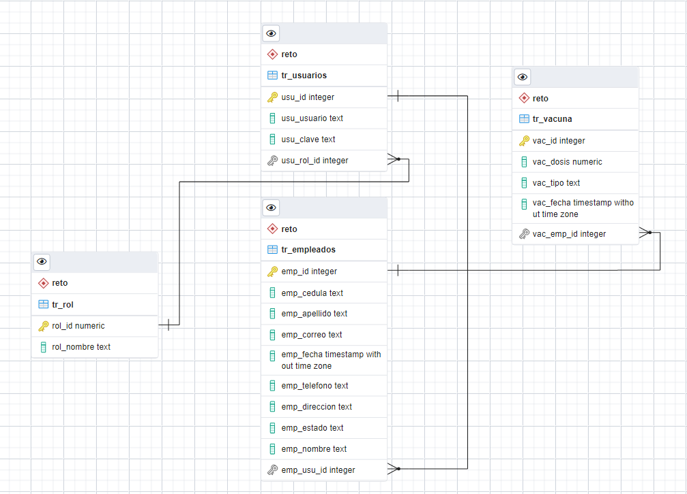

# RetoKrugger BACK END
### Condiciones de desarrollo:

- Tecnologías a utilizar son:
- Lenguaje: JAVA ○ Framework: Spring boot.
- Persistencia de datos: Base de datos Postgresql.
- Se debe exponer el API Rest necesaria, para poder consumir los
servicios de la aplicación.
- Se debe implementar la documentación de la API (Swagger-OpenAPI)
- Puede implementar autenticación OAuth 2.0, seguridades de los
endpoints basado en roles de usuarios
- Incluir el modelo de datos.
- Incluir todos los archivos necesarios para poder montar la aplicación en
un ambiente nuevo.
- Incluir un README.md detallando el proceso de construcción y
ejecución de la aplicación.

## Desarrollo

### 1. Diagrama Entidad Relación

Se genera el diagrama de Base de datos dando como resultado el siguiente:

### 2. Desarrollo Microservicios

Se realiza el reto sobre un proyecto en SpringBoot , gestionado por Maven.

Luego de haber generado la BD se procede con el desarrollo de los microservicios, se procede a 
maperar dentro de nuestro proyecto cada una de las entidades a usar, luego de desarrollar los endpoints se realiza
la configuración de autenticacion bajo roles, esto con Spring Security.

Al momento de desplegar el proyecto se verificara si no existe un usuario llamado ADMIN y lo genera teniendo este como credenciales:

- Usuario : admin
- Clave: admin

Este será el usuario con el que deberemos loggarnos apra realizar el test de nuestrs microservicios.

El usuario del empleado se genera de la siguiente manera:

- USUARIO = Cédula de Registro convertida a Mayusculas.
- CLAVE = NOMBRE + EL AÑO EN CURSO 

Un ejemplo para este caso 

Si el nombre del empleado es Juanito y su cedula es 1234567890

Sus credenciales serán:

- USUARIO = 1234567890
- CLAVE = JUANITO2022

En este caso se uso Swagger para la documentación de cada unas de nuestros Endpoints bajo el context _
- /rest/api

Para verificar cada endpoint una ves desplegado el proyecto lo podremos hacer en la siguiente direccion_
#### - http://localhost:7071/rest/api/swagger-ui.html#!/vacunas-controller/

# Despliegue

Dentro de la carpeta DATABASE se encuentra el sql para realizar el despliegue de la base de datos usada.

Adicional se Adjunta datos con los que se trabajo en este proyecto.

- Puerto=7071
- Context-path=/rest/api
- DB=retodb
- Username=postgres
- Password=postgres
- PuertoPostgres= 5432

